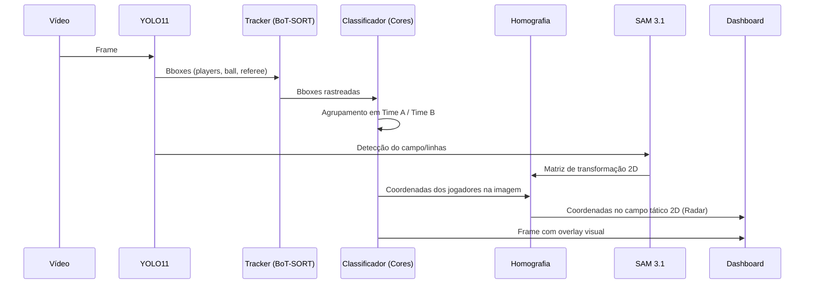

# ⚽ Plano de Arquitetura — Visão Computacional para Futebol

> **Projeto:** Detecção, Rastreamento e Análise Tática de Futebol  
> **Stack Core:** YOLOv11 · SAM 3.1 · PyTorch · FastAPI · Next.js  
> **Data:** 18/06/2026  

---

## 1. Visão Geral e Objetivos

### 1.1 Escopo do Projeto

Desenvolver uma aplicação de visão computacional capaz de processar **vídeos de partidas de futebol** (broadcasting ou câmeras táticas) para extrair dados analíticos e eventos do jogo:

| Funcionalidade | Descrição |
|---|---|
| **Detecção de Entidades** | Localizar jogadores, árbitros e a bola no frame |
| **Rastreamento Multi-Objeto** | Manter a identidade de cada jogador (IDs consistentes) |
| **Classificação de Times** | Separar jogadores em Time A, Time B e Árbitros |
| **Mapeamento Top-Down** | Homografia para projetar posições em um campinho 2D |
| **Reconhecimento de Ações** | Detectar eventos como passes, chutes e desarmes |
| **Análise Tática** | Gerar heatmaps, cálculo de posse de bola e distâncias |

### 1.2 Entidades-Alvo

O modelo YOLO precisará ser treinado para detectar:
- **`player`** (Jogador)
- **`referee`** (Árbitro)
- **`ball`** (Bola)

Posteriormente, os jogadores (`player`) serão classificados via agrupamento de cores (K-Means/CNN leve) nos times correspondentes.

### 1.3 Casos de Uso (Portfólio)

1. **Scouting de Jogadores** — Mapa de calor individual e métricas de velocidade
2. **Análise de Transmissão** — Overlays automáticos com ponteiros em cima dos jogadores e da bola
3. **Métricas Táticas** — Porcentagem de posse de bola e passes completos
4. **Análise de Linha de Impedimento** — Segmentação das linhas do campo com SAM 3.1 para gerar linhas virtuais

---

## 2. Stack Tecnológico

### 2.1 Modelos de IA

| Componente | Tecnologia | Papel |
|---|---|---|
| Detecção Base | **YOLO11** (Ultralytics) | Detecção rápida de jogadores e da bola |
| Segmentação | **SAM 3.1** (Meta, Mar/2026) | Segmentação precisa de jogadores, campo e linhas (via Promptable Concept Segmentation) |
| Rastreamento | **BoT-SORT / ByteTrack** | Otimizado para manter IDs mesmo em oclusões (escanteios, faltas) |
| Transformação 2D | **OpenCV (Homography)** | Conversão da perspectiva da câmera para visão tática (top-down) |
| Classificação de Ações | **Rede Custom / 3D-CNN** | Identificação temporal de passes e chutes |

### 2.2 Frameworks e Bibliotecas

```
# Core ML
pytorch >= 2.7
ultralytics >= 8.3
sam3                        # github.com/facebookresearch/sam3
torchvision
opencv-python >= 4.9

# Tracking & Analytics esportivo
supervision                  # Tracking e visualização (Roboflow)
scikit-learn                 # Clusterização (K-Means) para cores de camisa

# Back-End / Front-End
fastapi
celery & redis               # Para processamento assíncrono de vídeos longos
next.js & react              # Interface rica com painel tático
```

### 2.3 Infraestrutura

| Recurso | Recomendação |
|---|---|
| **Python** | 3.12+ |
| **PyTorch** | 2.7+ |
| **CUDA** | 12.6+ |
| **GPU Treino** | Google Colab Pro / NVIDIA RTX 3090+ |
| **GPU Inferência** | RTX 1650 (rodando versões nano/small do YOLO) |

---

## 3. Arquitetura do Sistema

### 3.1 Pipeline de Visão Computacional



---

## 4. Pipeline de Dados

### 4.1 Fontes de Dados
Para portfólio, futebol é excelente por ter datasets abertos muito ricos:
- **Roboflow Universe** (Centenas de datasets de futebol pré-anotados)
- **SoccerNet** (Dataset acadêmico enorme para tracking e action recognition)
- Vídeos do YouTube (Câmeras táticas ou de transmissão)

### 4.2 Estratégia de Anotação (Foco no YOLO11)
```
1. Detectar: player, referee, ball
2. A bola é o objeto mais difícil de detectar e rastrear devido a oclusão e motion blur.
3. Necessidade de alta resolução e fatiamento (SAHI - Slicing Aided Hyper Inference) caso os jogadores estejam muito pequenos.
```

### 4.3 Data Augmentation
```python
augmentations = {
    "geométricas": [
        "HorizontalFlip(p=0.5)",       
        "RandomCrop(p=0.2)",
    ], # NOTA: Nunca usar VerticalFlip em futebol!
    "fotométricas": [
        "RandomBrightnessContrast(p=0.4)",  # Jogos diurnos vs noturnos
        "MotionBlur(kernel=5, p=0.3)",      # Chutes rápidos na bola
    ]
}
```

---

## 5. Pipeline de Inferência e Aplicação

O fluxo de processamento e a infraestrutura de código (FastAPI + Next.js + Celery) permanecem **exatamente iguais** ao plano anterior. O que muda é o tipo de dado que trafegamos.

### Funcionalidades do Dashboard (Next.js)
1. **Vídeo Player Principal**: Overlay desenhando as bounding boxes e a cor do time.
2. **Radar 2D (Mini-mapa)**: Um campo de futebol estilizado mostrando as "bolinhas" se movendo em tempo real.
3. **Estatísticas**:
   - Posse de bola (Tempo em que a bola está próxima a jogadores do Time A vs B).
   - Distância percorrida pelo jogador `X`.
   - Velocidade máxima.

---

## 6. Cronograma por Fases (16 Semanas)

### Fase 1 — Fundação (Semanas 1–2)
| Tarefa | Entregável |
|---|---|
| Setup monorepo, Docker, CI/CD | `docker-compose.yml`, GitHub Actions |
| Coleta e extração de vídeos de futebol | Vídeos e frames em `data/raw/` |

### Fase 2 — Detecção e Tracking (Semanas 3–5)
| Tarefa | Entregável |
|---|---|
| Fine-tune YOLO11 para jogadores e bola | `yolo11_football.pt` |
| Tracking avançado com BoT-SORT | IDs consistentes testados |
| Clusterização de cores de camisa | Separação automática Time A / Time B |

### Fase 3 — Visão Tática e Homografia (Semanas 5–7)
| Tarefa | Entregável |
|---|---|
| Mapeamento de pontos do campo | Detecção de linhas/áreas com SAM 3.1 ou YOLO |
| Matriz de Homografia | Projeção das coordenadas da imagem para 2D |
| Cálculo de Posse e Distância | Lógica de analytics de futebol |

### Fase 4 — Reconhecimento de Ações (Opcional - Semanas 8–9)
| Tarefa | Entregável |
|---|---|
| Classificação de eventos | Detecção de passes e chutes |

### Fase 5 — Back-End (Semanas 10–12)
| Tarefa | Entregável |
|---|---|
| FastAPI com endpoints REST e WS | API processando vídeos e frames |
| Celery + Redis | Fila para vídeos longos (partidas inteiras) |

### Fase 6 — Front-End (Semanas 12–14)
| Tarefa | Entregável |
|---|---|
| Next.js com painel analítico | Dashboard tático responsivo |
| Canvas para o Radar 2D | Componente `<MiniMap />` |

### Fase 7 — Integração e Deploy (Semanas 15–16)
| Tarefa | Entregável |
|---|---|
| Testes E2E e otimização ONNX | Aplicação em produção / portfólio |

---

## 7. Riscos e Mitigações

| Risco | Impacto | Mitigação |
|---|---|---|
| **Perda da bola no tracking** | Alto | Interpolação linear da trajetória da bola + filtros de Kalman |
| **Oclusões no escanteio** | Alto | Uso de trackers baseados em re-identificação (ReID) visual |
| **Baixa resolução em wide-angle** | Médio | Usar modelo YOLOv11 em resoluções altas (e.g. 1280px) ou inferência fatiada (SAHI) |
